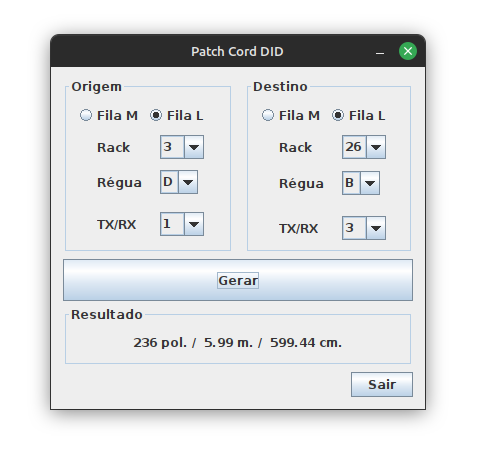
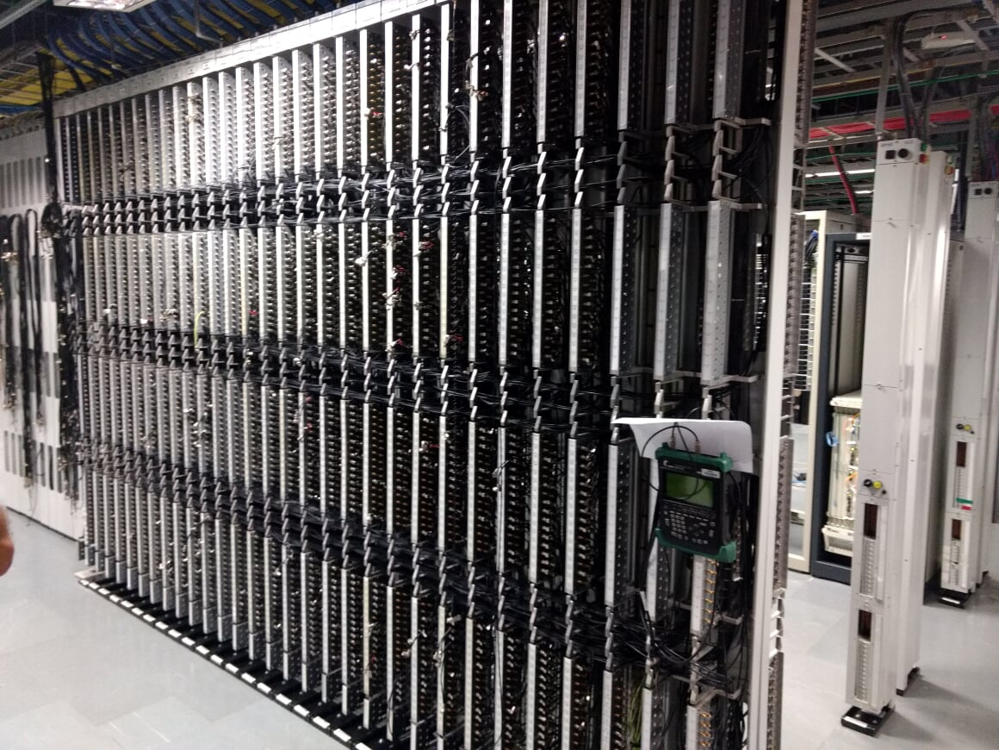

# Patch Cord DID

<h3>

</h3>
 

Java 1.8  
Swing  

Aplicativo criado para medir o tamanho de um patch cable coaxial para o equipamento DID, onde o cabo é gerado à partir da origem e destino.

Para executar o aplicativo, basta ter uma versão Java 8+ instalada e abrir o arquivo [PDiD.jar](./dist/PDiD.jar) 

Tela:

  

Um Rack DID

  

